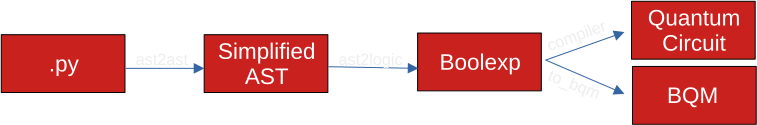
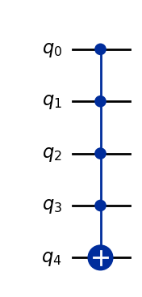
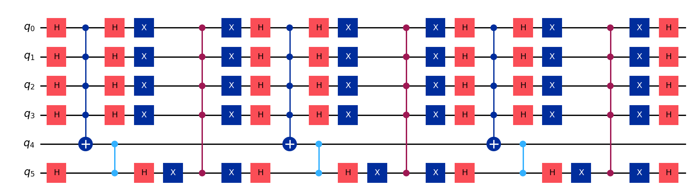
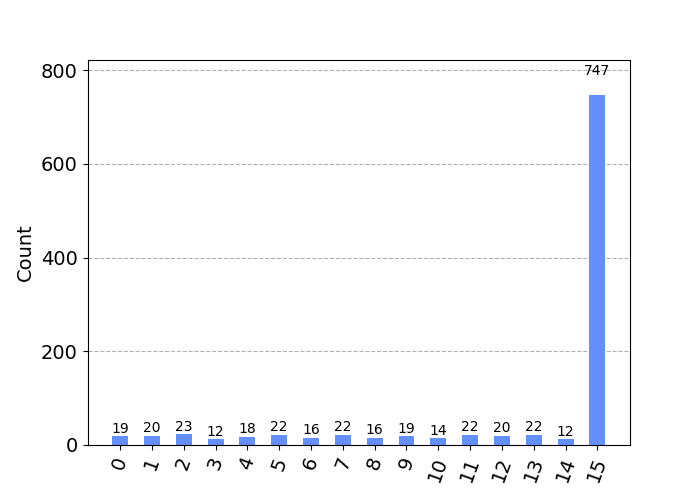

# Qlasskit


[](https://unitary.fund)


[](https://discord.com/channels/764231928676089909/1210279373865754624)
[](https://app.codacy.com/gh/dakk/qlasskit/dashboard?utm_source=gh&utm_medium=referral&utm_content=&utm_campaign=Badge_grade)
[](https://pepy.tech/project/qlasskit)


Qlasskit is a Python library that allows quantum developers to write classical algorithms in pure Python and translate them into unitary operators (gates) for use in quantum circuits, using boolean expressions as intermediate form.

This tool will be useful for any algorithm that relies on a 'blackbox' function and for describing the classical components of a quantum algorithm.

Qlasskit implements circuit / gate exporters for Qiskit, Cirq, Qasm, Sympy and Pennylane.

Qlasskit also support exporting to Binary Quadratic Models (bqm, ising and qubo) ready to be used in
quantum annealers, ising machines, simulators, etc.





```bash
pip install qlasskit
```

For a quickstart, read the _quickstart_ and _examples_ notebooks from the documentation: [https://dakk.github.io/qlasskit](https://dakk.github.io/qlasskit).

```python
from qlasskit import qlassf, Qint 

@qlassf
def h(k: Qint[4]) -> bool:
    h = True
    for i in range(4):
        h = h and k[i]
    return h
```


Qlasskit will take care of translating the function to boolean expressions, simplify them and
translate to a quantum circuit.



Then, we can use grover to find which h(k) returns True:

```python
from qlasskit.algorithms import Grover

algo = Grover(h, True)
qc = algo.circuit().export("circuit", "qiskit")
```

And that's the result:



Qlasskit also offers type abstraction for encoding inputs and decoding results:

```python
counts_readable = algo.decode_counts(counts)
plot_histogram(counts_readable)
```



You can also use other functions inside a qlassf:

```python
@qlassf
def equal_8(n: Qint[4]) -> bool:
  return equal_8 == 8

@qlassfa(defs=[equal_8])
def f(n: Qint[4]) -> bool:
  n = n+1 if equal_8(n) else n
  return n
```

Qlasskit supports complex data types, like tuples and fixed size lists:

```python
@qlassf
def f(a: Tuple[Qint[8], Qint[8]]) -> Tuple[bool, bool]:
  return a[0] == 42, a[1] == 0
```

```python
@qlassf
def search(alist: Qlist[Qint[2], 4], to_search: Qint[2]):
  for x in alist:
    if x == to_search:
      return True
  return False
```


Qlasskit function can be parameterized, and the parameter can be bind before compilation:

```python
@qlassf
def test(a: Parameter[bool], b: bool) -> bool:
    return a and b

qf = test.bind(a=True)
```


## Contributing

Read [CONTRIBUTING](CONTRIBUTING.md) for details.

## License

This software is licensed with [Apache License 2.0](LICENSE).


## Cite

```
@software{qlasskit2023,
  author = {Davide Gessa},
  title = {qlasskit: a python-to-quantum circuit compiler},
  url = {https://github.com/dakk/qlasskit},
  year = {2023},
}
```

## About the author

Davide Gessa (dakk)
- <https://twitter.com/dagide>
- <https://mastodon.social/@dagide>
- <https://dakk.github.io/>
- <https://medium.com/@dakk>